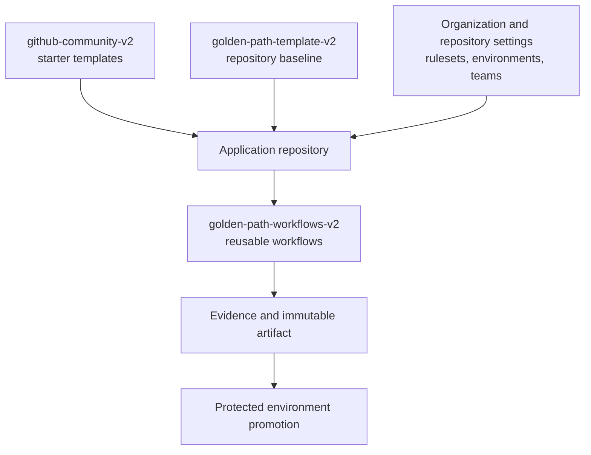

# GitHub Golden Path architecture

## Repository structure

### Central reusable workflows

`golden-path-workflows-v2` owns orchestration that should be maintained centrally:

- PR branch and release-label policy
- CI and coverage gates
- CodeQL and dependency review
- ZAP DAST
- Artifact promotion
- Production verification
- Semantic release creation

### Application template

`golden-path-template-v2` owns:

- Thin caller workflows
- Language-specific scripts and sample application
- Pull-request, CODEOWNERS, Dependabot, and exception templates
- Governance specifications
- Developer and administrator documentation

### Demonstration consumer

`golden-path-sandbox-v2` is a separate consumer used to prove that the central workflows can be adopted without copying their orchestration logic.

### Organization community staging

`github-community-v2` contains workflow templates and community defaults. GitHub activates organization-wide workflow templates only from a repository named exactly `.github`; this v2 repository is deliberately isolated until approval.

## GitHub concepts

| Concept | Purpose | Enforces behavior? |
|---|---|---:|
| Workflow template | Helps a repository add a starter workflow | No |
| Reusable workflow | Executes centrally maintained jobs from a caller | Only when called and required |
| Required status check | Blocks merge until a named check passes | Yes, through a ruleset |
| Composite action | Packages repeated steps inside a job | Only when invoked; not needed for this small POC |
| Repository template | Creates a new repository from an approved file baseline | No continuing enforcement |
| Organization ruleset | Applies branch/tag policy across selected repositories | Yes |
| GitHub Environment | Protects deployments, reviewers, secrets, and branch access | Yes when configured |

## Variables and secrets

| Scope | Use |
|---|---|
| Organization variable | Non-sensitive defaults shared by many repositories |
| Repository variable | Non-sensitive application-specific configuration |
| Environment variable | Non-sensitive target-specific configuration |
| Organization secret | Shared secret with an explicit repository allowlist |
| Repository secret | Application secret not tied to a deployment target |
| Environment secret | Preferred deployment credential scope; exposed only to jobs that pass the environment gate |

OIDC should replace long-lived cloud credentials where the deployment platform supports it.
