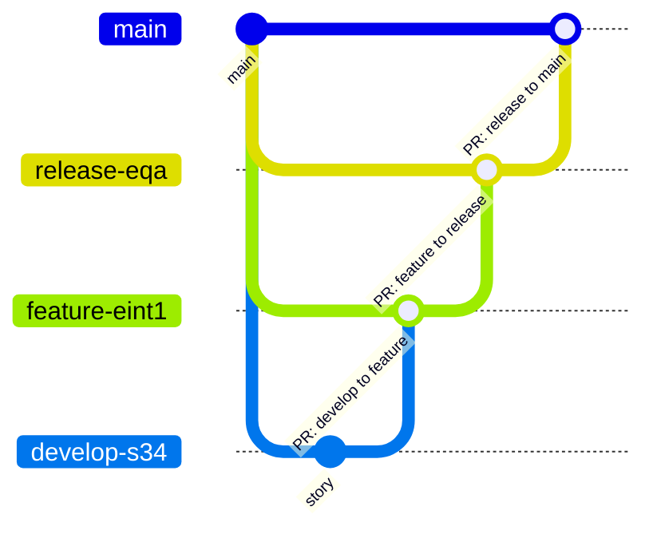

# Branching strategy

The screenshot-derived COUNTRY standard is authoritative for this POC.

## Branch contracts

| Type | Created from | Normal target | Purpose | Lifecycle |
|---|---|---|---|---|
| `main` | Repository initialization | N/A | Official production history | Permanent |
| `release-<environment>-<description>` | `main` | `main` | Prepare and validate a production release | Release duration |
| `feature-<eint>-<Rally feature ID>` | Release branch | Release branch | Deliver a larger feature | At most one PI |
| `develop-<Rally story ID>` | Feature branch | Feature branch | Implement an individual story | Short-lived |
| `hotfix-<environment>-<description>` | `main` | `main` | Repair production | Short-lived |
| `prerelease-<eint>-<description>` | Not fully specified | Not technically constrained in this POC | Environment-oriented validation | Pending clarification |

## Allowed PR transitions

The reusable PR-policy check permits:

- `develop-* → feature-*`
- `feature-* → release-*`
- `release-* → main`
- `hotfix-* → main`
- `dependabot/* → main`, with the normal checks; it is classified as `patch`
- `main → release-*` for synchronization after a hotfix/release
- `release-* → feature-*` for downstream synchronization

The prerelease path remains documented rather than guessed because the supplied evidence does not completely define its promotion path.

## Hotfix recommendation

The current GitLab standard intentionally leaves hotfix branches unprotected. The GitHub recommendation is an expedited hotfix PR into `main`, followed by synchronization to release and feature. Any emergency bypass should be narrow, time-bound, and auditable.
